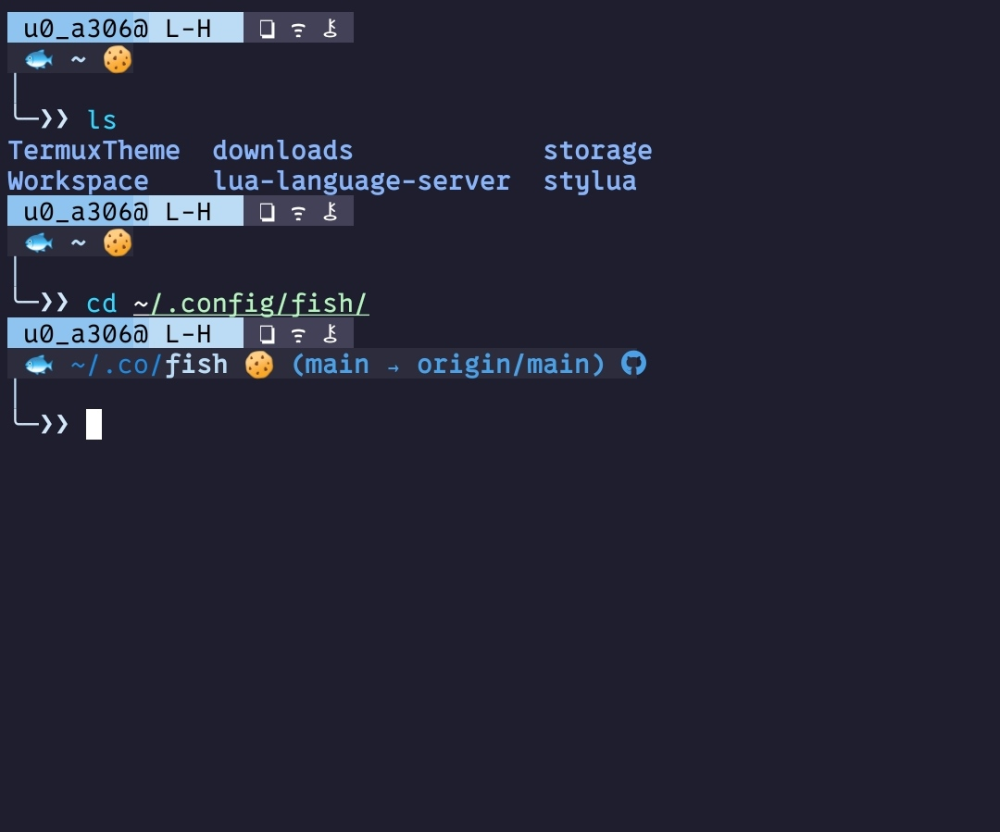

## Setting Up Your Fish appearance

To set up your Fish appearance from the repository, follow these steps:

1. **Clone the Repository:**
   Open your terminal and clone the repository to your local machine:
 ```
 git clone https://github.com/OxRachid/MyFishConfig ~/.config/fish
 ```

This command clones the repository directly into the Fish configuration directory.

2. **Source the Configuration:**
 To apply the changes immediately without restarting your terminal, source the Fish configuration:
 ```
 source ~/.config/fish/config.fish
 ```

### Note
To achieve the same appearance you must change the background color of termux in file has the name `~/.termux/colors.properties`\ , you can also change all colors in this file by replacing your default colors with these catppucin theme colors  

 ```
 background=#1e1e2e
 foreground=#ffffff
 color0=#1e1e2e
 color1=#f38ba8
 color2=#a6e3a1
 color3=#f9e2af
 color4=#89b4fa
 color5=#cba6f7
 color6=#89dceb
 color7=#bac2de
 color8=#45475a
 color9=#f38ba8
 color10=#e6e600
 color11=#f9e2af
 color12=#89b4fa
 color13=#cba6f7
 color14=#89dceb
 color15=#cdd6f4
 ```

After that reload the termux to apply the changes:
 ```
 termux-reload-settings
 ```
